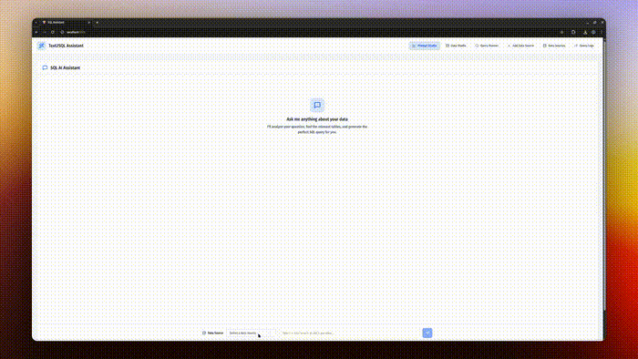

# 🧠 AskBI – Natural Language to SQL Assistant

Ask questions. Get SQL. Run queries. Visualize results.  
**AskBI** is an open-source, lightweight analytics assistant that turns plain English into powerful insights.



---

## 🚀 Features

- 💬 Ask natural language questions like:
  > "What were last month's top-selling products?"
- 🧠 LLM-generated SQL (OpenAI)
- 🔍 Smart table and column detection from metadata
- 🧾 SQL editor with execution + result preview
- 📊 Automated visualizations using Microsoft Lida and Vega
- 🪵 Query logs with execution time + result summary
- 📁 Temporary Parquet file output (`/tmp`)

---

## ⚙️ Stack

| Layer     | Tech                              |
| --------- | --------------------------------- |
| Frontend  | React, Tailwind CSS, ShadCN, LIDA |
| Backend   | FastAPI                           |
| Storage   | Parquet                           |
| AI Engine | OpenAI GPT-4                      |
| Auth      | Coming soon                       |

---

## 🧪 Run Locally

Clone and run the project locally with:

```bash
git clone https://github.com/<your-username>/AskBI.git
cd AskBI

# Backend
cd backend
cp .env.example .env

# Main dir
cd ..
docker compose up --build

# Frontend (in new terminal)
cd ../ui
npm install
npm run dev
```
